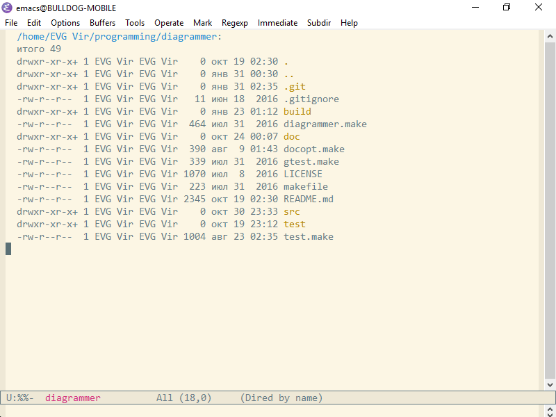
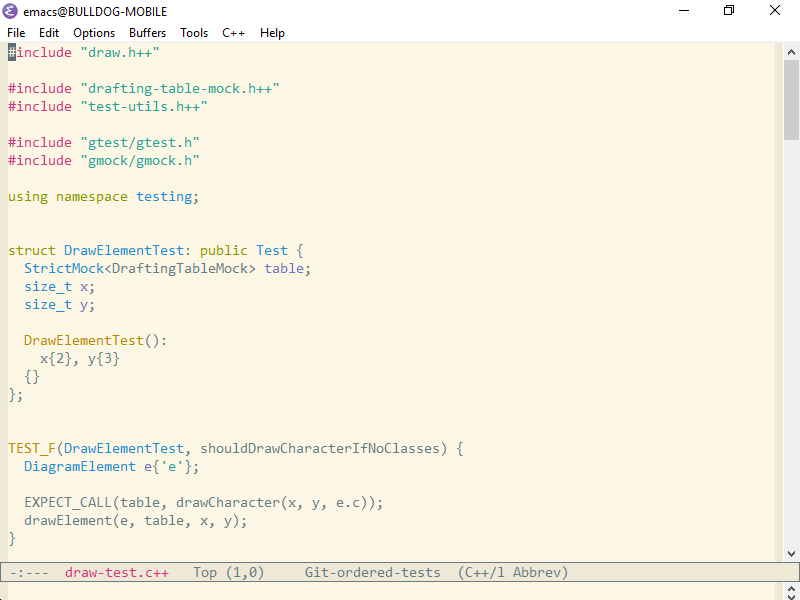

Find File in Git
================

A Emacs package that simplifies searching and opening files in Git
repositories.

A file can be opened by entering only a part of its name after `C-x
M-a` keystroke (customizable). If this part is unique in the current
Git repository, this file will be opened:

If the part of a file name is not unique, a list of all possible
variants will be displayed:

If a file name is already written under the point it will be suggested
to search for a file with this name:

